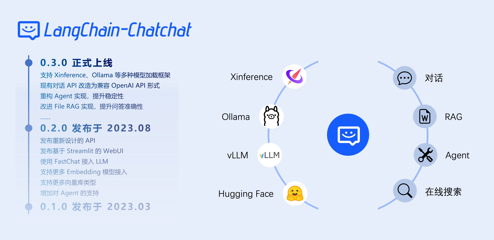
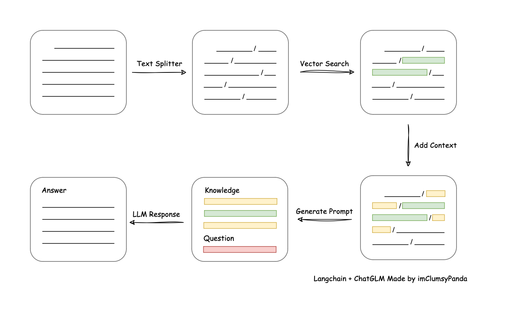
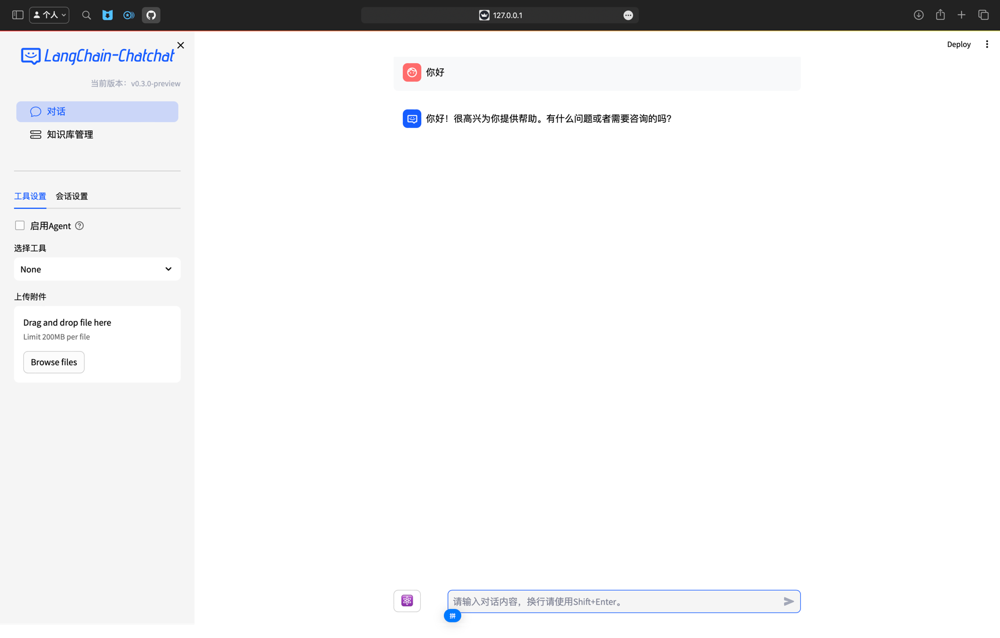

[](https://shields.io/)
[](https://pypi.org/project/pypiserver/)

# Apollo-Chatchat

An open-source, offline-deployable RAG and Agent application built on top of large language models (such as ChatGLM, Qwen, Llama) and the [LangChain](https://github.com/langchain-ai/langchain) framework.

---

## Contents

* [Overview](#overview)
* [What Apollo-Chatchat Offers](#what-apollo-chatchat-offers)
* [Quick Start](#quick-start)
    * [Installation](#installation)
* [Migration from Older Versions](#migration-from-older-versions)
* [License](#license)
* [Project Milestones](#project-milestones)

## Overview

Apollo-Chatchat is a question-answering application based on local knowledge bases, built around the [LangChain](https://github.com/langchain-ai/langchain) concept. The goal is to deliver a friendly, offline-capable knowledge-base Q&A solution that works well with mainstream open-source models.

The project uses standard inference servers (Xinference, Ollama, LocalAI, FastChat) to host models such as Vicuna, Alpaca, LLaMA, Koala, and RWKV. It exposes both a FastAPI-based HTTP API and a Streamlit WebUI.



Apollo-Chatchat supports the most popular open-source LLMs, embedding models, and vector databases, enabling fully **offline, private deployment**. It also supports the OpenAI API and will continue to add new model providers.

The pipeline is: load documents → extract text → split into chunks → vectorize chunks → vectorize the user question → match the `top k` most similar chunks → concatenate the matched chunks with the question into a prompt → submit to the LLM and return the answer.


From a document-processing perspective the pipeline looks like this:



Apollo-Chatchat does not perform fine-tuning or training itself, but you can plug in fine-tuned or trained models to improve quality.

If you want to contribute, see the [Developer Guide](docs/contributing/README_dev.md) for development and deployment details.

## What Apollo-Chatchat Offers

### Highlights of Version 0.3.x

| Feature                         | 0.2.x                                     | 0.3.x                                                                                                                                                  |
|---------------------------------|-------------------------------------------|--------------------------------------------------------------------------------------------------------------------------------------------------------|
| Model integration               | Local: fastchat<br>Online: XXXModelWorker | Local: model_provider, supporting most mainstream inference frameworks<br>Online: oneapi<br>All integrations are compatible with the OpenAI SDK        |
| Agent                           | Unstable                                  | Optimized for ChatGLM3 and Qwen; significantly stronger Agent capabilities                                                                              |
| LLM conversations               | Yes                                       | Yes                                                                                                                                                    |
| Knowledge-base conversations    | Yes                                       | Yes                                                                                                                                                    |
| Search-engine conversations     | Yes                                       | Yes                                                                                                                                                    |
| File conversations              | Vector search only                        | Unified File RAG: supports BM25+KNN and other retrieval methods                                                                                        |
| Database conversations          | No                                        | Yes                                                                                                                                                    |
| arXiv conversations             | No                                        | Yes                                                                                                                                                    |
| Wolfram conversations           | No                                        | Yes                                                                                                                                                    |
| Text-to-image                   | No                                        | Yes                                                                                                                                                    |
| Local knowledge-base management | Yes                                       | Yes                                                                                                                                                    |
| WebUI                           | Yes                                       | Yes, with better multi-session support and custom system prompts                                                                                       |

In 0.3.x the core functionality is implemented through an Agent, but you can also invoke tools manually:

| Operating Mode                              | Behavior                                              | When To Use                                                                                          |
|---------------------------------------------|-------------------------------------------------------|------------------------------------------------------------------------------------------------------|
| "Enable Agent" + multiple tools             | LLM picks and calls tools automatically               | When using Agent-capable models such as ChatGLM3 / Qwen, or online APIs                              |
| "Enable Agent" + a single tool              | LLM only parses parameters for that tool              | When the model has only basic Agent capabilities and cannot reliably select a tool                   |
| "Enable Agent" disabled + a single tool     | Manually fill the parameters; tool is called directly | When using models without Agent capabilities                                                          |

More features can be explored once you deploy the project.

### Supported Model-Serving Frameworks and Models

Apollo-Chatchat supports mainstream open-source models such as [GLM-4-Chat](https://github.com/THUDM/GLM-4) and [Qwen2-Instruct](https://github.com/QwenLM/Qwen2). You start the model-serving framework and load the models you want, then point the application at it via configuration.

| Framework                           | Xinference                                                                                          | LocalAI                                                               | Ollama                                                                                    | FastChat                                                                                        |
|-------------------------------------|-----------------------------------------------------------------------------------------------------|-----------------------------------------------------------------------|-------------------------------------------------------------------------------------------|-------------------------------------------------------------------------------------------------|
| OpenAI-compatible API               | Yes                                                                                                 | Yes                                                                   | Yes                                                                                       | Yes                                                                                             |
| Accelerated inference engine        | GPTQ, GGML, vLLM, TensorRT                                                                          | GPTQ, GGML, vLLM, TensorRT                                            | GGUF, GGML                                                                                | vLLM                                                                                            |
| Model types supported               | LLM, Embedding, Rerank, Text-to-Image, Vision, Audio                                                | LLM, Embedding, Rerank, Text-to-Image, Vision, Audio                  | LLM, Text-to-Image, Vision                                                                | LLM, Vision                                                                                     |
| Function calling                    | Yes                                                                                                 | Yes                                                                   | Yes                                                                                       | /                                                                                               |
| Cross-platform (CPU, Metal)         | Yes                                                                                                 | Yes                                                                   | Yes                                                                                       | Yes                                                                                             |
| Heterogeneous                       | Yes                                                                                                 | Yes                                                                   | /                                                                                         | /                                                                                               |
| Cluster                             | Yes                                                                                                 | Yes                                                                   | /                                                                                         | /                                                                                               |
| Documentation                       | [Xinference docs](https://inference.readthedocs.io/en/latest/models/builtin/index.html)             | [LocalAI docs](https://localai.io/model-compatibility/)               | [Ollama docs](https://github.com/ollama/ollama?tab=readme-ov-file#model-library)          | [FastChat docs](https://github.com/lm-sys/FastChat#install)                                     |
| Available models                    | [Xinference models](https://inference.readthedocs.io/en/latest/models/builtin/index.html)           | [LocalAI models](https://localai.io/model-compatibility/#/)           | [Ollama models](https://ollama.com/library#)                                              | [FastChat models](https://github.com/lm-sys/FastChat/blob/main/docs/model_support.md)           |

In addition to the local model-serving frameworks above, the project also integrates with [One API](https://github.com/songquanpeng/one-api) for routing to popular online APIs such as [OpenAI ChatGPT](https://platform.openai.com/docs/guides/gpt/chat-completions-api), [Azure OpenAI](https://learn.microsoft.com/en-us/azure/ai-services/openai/reference), [Anthropic Claude](https://anthropic.com/), [Zhipu GLM](https://bigmodel.cn/), and [Baichuan](https://platform.baichuan-ai.com/).

> [!Note]
> Loading local models with Xinference: built-in models download automatically. To use locally downloaded models, run `streamlit run xinference_manager.py` from `tools/model_loaders/` once Xinference is running and configure the local path for the specified model from the UI.

## Quick Start

### Installation

#### 0. Software and hardware requirements

* Python 3.10 or 3.11. Tested on Windows, macOS, and Linux.
* Any of CPU, GPU, NPU, or MPS works, because all model loading happens in the selected serving framework.

#### 1. Install Apollo-Chatchat

Starting from 0.3.0 the project is distributed as a Python package:

```shell
pip install apollo-chatchat -U
```

> [!Note]
> If you plan to use Xinference, install the optional dependencies:
> ```shell
> pip install "apollo-chatchat[xinference]" -U
> ```

#### 2. Start a model-serving framework and load models

From 0.3.0 onwards, Apollo-Chatchat does not load models directly from a local path. The model types (LLM, Embedding, Reranker, and multi-modal models) are loaded by an inference framework such as [Xinference](https://github.com/xorbitsai/inference), [Ollama](https://github.com/ollama/ollama), [LocalAI](https://github.com/mudler/LocalAI), [FastChat](https://github.com/lm-sys/FastChat), or [One API](https://github.com/songquanpeng/one-api).

Make sure the framework is running and the desired models are loaded before you start Apollo-Chatchat. See the [Xinference docs](https://inference.readthedocs.io/en/latest/getting_started/installation.html) for an example.

> [!WARNING]
> To avoid dependency conflicts, install Apollo-Chatchat and the model-serving framework in different Python virtual environments (conda, venv, virtualenv, etc.).

#### 3. View and modify the Apollo-Chatchat configuration

Starting from 0.3.0 configuration is managed via the CLI; future versions will add an in-UI configuration page.

##### 3.1 View available configuration groups

```shell
chatchat-config --help
```

You will see:

```text
Usage: chatchat-config [OPTIONS] COMMAND [ARGS]...

  `chatchat-config` workspace configuration

Options:
  --help  Show this message and exit.

Commands:
  basic   Basic configuration
  kb      Knowledge-base configuration
  model   Model configuration
  server  Server configuration
```

For example, to view or modify the basic configuration:

```shell
chatchat-config basic --help
```

```text
Usage: chatchat-config basic [OPTIONS]

  Basic configuration

Options:
  --verbose [true|false]  Enable verbose logging
  --data TEXT             Path for initialization data; the directory will be wiped and recreated
  --format TEXT           Log format
  --clear                 Clear configuration
  --show                  Show configuration
  --help                  Show this message and exit.
```

##### 3.2 Inspect the current configuration

```shell
chatchat-config basic --show
```

Without any modifications, the default is:

```text
{
    "log_verbose": false,
    "CHATCHAT_ROOT": "/root/anaconda3/envs/chatchat/lib/python3.11/site-packages/chatchat",
    "DATA_PATH": "/root/anaconda3/envs/chatchat/lib/python3.11/site-packages/chatchat/data",
    "IMG_DIR": "/root/anaconda3/envs/chatchat/lib/python3.11/site-packages/chatchat/img",
    "NLTK_DATA_PATH": "/root/anaconda3/envs/chatchat/lib/python3.11/site-packages/chatchat/data/nltk_data",
    "LOG_FORMAT": "%(asctime)s - %(filename)s[line:%(lineno)d] - %(levelname)s: %(message)s",
    "LOG_PATH": "/root/anaconda3/envs/chatchat/lib/python3.11/site-packages/chatchat/data/logs",
    "MEDIA_PATH": "/root/anaconda3/envs/chatchat/lib/python3.11/site-packages/chatchat/data/media",
    "BASE_TEMP_DIR": "/root/anaconda3/envs/chatchat/lib/python3.11/site-packages/chatchat/data/temp",
    "class_name": "ConfigBasic"
}
```

##### 3.3 Change the default LLM

```shell
chatchat-config model --help
```

```text
Usage: chatchat-config model [OPTIONS]

  Model configuration

Options:
  --default_llm_model TEXT        Default LLM
  --default_embedding_model TEXT  Default embedding model
  --agent_model TEXT              Agent model
  --history_len INTEGER           History length
  --max_tokens INTEGER            Max tokens
  --temperature FLOAT             Temperature
  --support_agent_models TEXT     Supported Agent models
  --set_model_platforms TEXT      Model platform configuration as a JSON string
  --set_tool_config TEXT          Tool configuration as a JSON string
  --clear                         Clear configuration
  --show                          Show configuration
  --help                          Show this message and exit.
```

Inspect the current model configuration:

```shell
chatchat-config model --show
```

```text
{
    "DEFAULT_LLM_MODEL": "glm4-chat",
    "DEFAULT_EMBEDDING_MODEL": "bge-large-zh-v1.5",
    "Agent_MODEL": null,
    "HISTORY_LEN": 3,
    "MAX_TOKENS": null,
    "TEMPERATURE": 0.7,
    ...
    "class_name": "ConfigModel"
}
```

Switch the default LLM to `qwen2-instruct`:

```shell
chatchat-config model --default_llm_model qwen2-instruct
```

For deeper configuration help, see [libs/apollo-chatchat-server/README.md](libs/apollo-chatchat-server/README.md).

#### 4. Configure custom model integrations

After completing the previous steps, decide which serving framework and models you want to integrate. Apollo-Chatchat supports [Xinference](https://github.com/xorbitsai/inference), [Ollama](https://github.com/ollama/ollama), [LocalAI](https://github.com/mudler/LocalAI), [FastChat](https://github.com/lm-sys/FastChat), and [One API](https://github.com/songquanpeng/one-api), with native support for newer Chinese open-source models such as [GLM-4-Chat](https://github.com/THUDM/GLM-4) and [Qwen2-Instruct](https://github.com/QwenLM/Qwen2).

If you already have an OpenAI-compatible endpoint, configure it directly in `MODEL_PLATFORMS`:

```text
chatchat-config model --set_model_platforms TEXT      Configure model platforms as a JSON string.
```

- `platform_name` can be anything as long as it is unique.
- `platform_type` is reserved for future per-platform feature flags and should match `platform_name` for now.
- List the models loaded on the framework in the corresponding list. Multiple frameworks can host the same model name; the project will automatically load-balance.

Example:

```shell
$ chatchat-config model --set_model_platforms "[{
    \"platform_name\": \"xinference\",
    \"platform_type\": \"xinference\",
    \"api_base_url\": \"http://127.0.0.1:9997/v1\",
    \"api_key\": \"EMPTY\",
    \"api_concurrencies\": 5,
    \"llm_models\": [
        \"autodl-tmp-glm-4-9b-chat\"
    ],
    \"embed_models\": [
        \"bge-large-zh-v1.5\"
    ],
    \"image_models\": [],
    \"reranking_models\": [],
    \"speech2text_models\": [],
    \"tts_models\": []
}]"
```

#### 5. Initialize the knowledge base

> [!WARNING]
> Before initializing the knowledge base, make sure the inference framework and embedding model are running and that steps 3 and 4 are complete.

```shell
cd # Return to your home directory
chatchat-kb -r
```

Specify an embedding model explicitly (if needed):

```shell
cd # Return to your home directory
chatchat-kb -r --embed-model=text-embedding-3-small
```

On success you will see:

```text

----------------------------------------------------------------------------------------------------
Knowledge base name : samples
Knowledge base type : faiss
Embedding model     : bge-large-zh-v1.5
Knowledge base path : /root/anaconda3/envs/chatchat/lib/python3.11/site-packages/chatchat/data/knowledge_base/samples
Total files         : 47
Indexed files       : 42
Knowledge entries   : 740
Elapsed             : 0:02:29.701002
----------------------------------------------------------------------------------------------------

Total elapsed       : 0:02:33.414425

```

The knowledge base is stored under the `knowledge_base` directory inside the `DATA_PATH` shown in step 3.2:

```shell
(chatchat) [root@VM-centos ~]# ls /root/anaconda3/envs/chatchat/lib/python3.11/site-packages/chatchat/data/knowledge_base/samples/vector_store
bge-large-zh-v1.5  text-embedding-3-small
```

##### Frequently asked questions

##### 1. Stuck when rebuilding the knowledge base or adding files on Windows

This often happens in newly created virtual environments. Confirm it via:

```python
from unstructured.partition.auto import partition
```

If that statement hangs, run:

```shell
pip uninstall python-magic-bin
# Check the version that was uninstalled
pip install 'python-magic-bin=={version}'
```

Then re-run the knowledge-base creation steps above.

#### 6. Start the project

```shell
chatchat -a
```

A successful start looks like:



> [!WARNING]
> The server's `DEFAULT_BIND_HOST` is `127.0.0.1` by default, so it is not reachable from other IPs.
>
> <details>
> <summary>How to change it</summary>
>
> ```shell
> chatchat-config server --show
> ```
> Returns:
> ```text
> {
>     "HTTPX_DEFAULT_TIMEOUT": 300.0,
>     "OPEN_CROSS_DOMAIN": true,
>     "DEFAULT_BIND_HOST": "127.0.0.1",
>     "WEBUI_SERVER_PORT": 8501,
>     "API_SERVER_PORT": 7861,
>     "WEBUI_SERVER": {
>         "host": "127.0.0.1",
>         "port": 8501
>     },
>     "API_SERVER": {
>         "host": "127.0.0.1",
>         "port": 7861
>     },
>     "class_name": "ConfigServer"
> }
> ```
> To expose the service on the machine's IP (for example on Linux), bind to `0.0.0.0`:
> ```shell
> chatchat-config server --default_bind_host=0.0.0.0
> ```
> </details>

### Migration from Older Versions

* The 0.3.x architecture differs substantially from 0.2.x. We strongly recommend re-deploying from scratch using the documentation above. The migration steps below do not guarantee a 100% successful upgrade — back up important data first.

- Set up the environment following the steps in *Installation*.
- Configure `DATA` and other options.
- Copy the `knowledge_base` directory from the 0.2.x project into the configured `DATA` directory.

---

## License

The code in this project is licensed under [Apache-2.0](LICENSE).

## Project Milestones

+ **April 2023**: Langchain-ChatGLM 0.1.0 released — local knowledge-base Q&A based on the ChatGLM-6B model.
+ **August 2023**: Langchain-ChatGLM renamed to Langchain-Chatchat; 0.2.0 released using `fastchat` as the model loading layer with support for more models and databases.
+ **October 2023**: Langchain-Chatchat 0.2.5 released with Agent functionality.
+ **December 2023**: Langchain-Chatchat passed 20K GitHub stars.
+ **June 2024**: Langchain-Chatchat 0.3.0 released, introducing a new project architecture.
+ **Apollo-Chatchat fork**: Maintained by [Joseff531](https://github.com/Joseff531) — English-first, with the project rebranded to Apollo-Chatchat.
